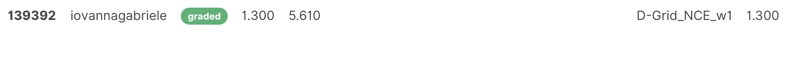
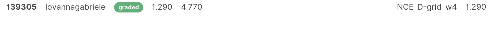
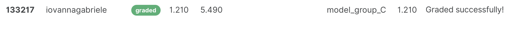
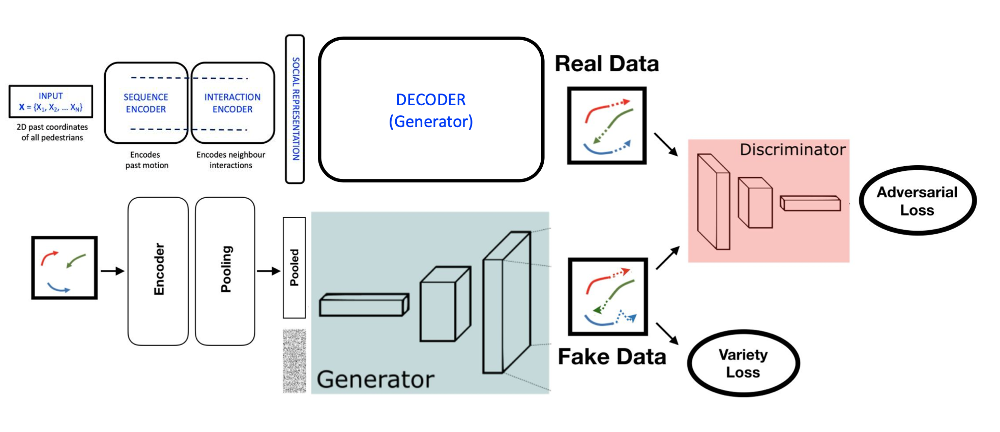
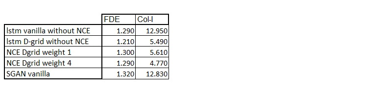

Milestone 1, superiority of D-Grid compare to vanilla
========================================

.. figure:: docs/train/1img.png

On this graph we can clearly see that the path realised with the vanilla simulation will converge with the other four present trajectories, there is a conflict point at [0,0]. The Vanilla simulation does not know how to react and will tend to accelerate in an attempt to anticipate the trajectories coming from the northwest quadrant of the graph. This will make the situation worse as there is a higher speed and it can only react less well to the change of trajectory such as the one made by the trajectory starting at the point [-4,1]. In contrast to this, the D-Grid simulation opted for a more wait-and-see solution and slightly decreased the speed that was initially planned for the person being steered, thus allowing observation of the behaviour of other people on the graph. Thus we can take a step back and avoid the conflict situation. This behaviour is therefore more appropriate to a situation of convergence of trajectories.

.. figure:: docs/train/2img.png

This situation is reminiscent of the convergence situation discussed earlier in this case we observe that the Vanilla simulation converges again with the other trajectories. Contrary to this, the D-Grid simulation will deviate from the point of convergence by anticipating the trajectory coming from the point [3,0.5] as rectilinear and will therefore pass behind this user. Thanks to this anticipation we avoid the conflict zone present in the centre of the graph at the end of the experiment.

.. figure:: docs/train/3img.png

This last image is the most representative It first demonstrates that the Vanillas strategy leads to a conflict zone because if we follow the trajectory it dictates we will collide with the trajectory from the point [-3.5,-1] which should never happen. The D-Grid strategy has the ability to follow the trajectory initially planned by the guided person. In our case it is also an optimal trajectory, as it avoids the accident generated by the vanilla strategy by taking the lead.

Milestone 2
========================================
In a second step (milestone 2), a social contrastive learning to the D-LSTM model has been applied. To do so we have implemented contrastive learning and sampling methods in your own codebase and tuned the social hyperparameters to optimize our results.

Our Social-NCE encourages the extracted motion representation to preserve sufficient training to distinguish a positive future event from a set of synthetic negative events.
At first, we had to find a way not to take into account the data including NaNs. For that we decided to place the trajectories containing NaNs, at the origin of our reference frame, i.e. far from the center of our scene (bottom left corner of our study area) where the trajectories cross and where collision zones are possible.
The negative sampling strategy constructs negative events based on the regions of other agents in the future, since it is generally forbidden to be in the same location as another agent (collision zone) or uncomfortable for multiple agents to visit the same or adjacent locations simultaneously (See Social Contrastive Sampling in figure 1).

.. figure:: docs/train/4img.png

This diagram graphically summarizes the structure used to code social contrastive learning.
After having generated the negative and positive samples as explained above, we then have defined the forecasting model that are designed as encoder-decoder neural networks, where the motion encoder first extracts a compact representation hit with respect to the different agent and the decoder subsequently rolls out its future trajectory. We were there able to construct the encoded query and key vectors for the primary agent at each time t. Thank to the features we have extracted we have computed. One of the last thing to do was to train the parametric models jointly with the objective of mapping the positive pair of query and keys to the similar points, relative to the other negative pairs, in the embedding space. To finish we have computed the total loss of our model, which is the sum of the trajectory forecasting and social contrastive loss that we want to minimize.
Once we implemented social contrastive learning we train on real data and synth data using 25 epochs and a weight of 1 and 4 for contrastive learning. Next we tested our models and uploaded them to AIcrowd. Below is the result for the contrastive weight of 1:

Below is the contrastive weight result of 4:

Below is the DGrid result without contrastive learning:

As we can see the overall value of FDE is better for DGrig model. This can be related either to the fact that we were not able to preload the old model and train with the contrastive learning from the old hyperparameters. However in the case in which we choose a weight of 4 for the social contrastive we notice that the number of collisions is lower than the DGrid value. We see that the social contrastive with a weight of 4 has a positive effect on the number of collisions and therefore it takes into account the points around the neighbors that if it is reached could lead to a collision. To see better results for the contrastive learning we should train the models starting from the hyperparameters obtained with the DGrid model in order to start from an already good model.

Milestone 3
========================================

The Generative Adversarial Network, or GAN for short, is an architecture for training a generative model. This method is mainly used to train recurrent neural networks

The architecture is composed of two models. The generator that we are interested in and attempts to maximise the probability of D making a mistake, and a discriminator model that is used to help train the generator (Estimates the probabilities that a sample came from the training data rather than from the generator G).

The GAN training algorithm involves training both the discriminator and the generator model in parallel:
-The discriminator trains during one epoch.
-The generator trains during one epochs.
We then repeat both steps alternatively 25 times (our number of epoch trained) to continue training the generator and discriminator networks.

We can then describe this alternating process in more detail:
First, a batch of random points from the latent space must be selected for use as input to the generative model to provide the basis for the generated samples (fake samples). Then, a batch of samples from the training dataset must be selected to be input to the discriminator as "real samples”.
Then, the discriminator model must make predictions for the real and false samples and the discriminator weights must be updated in proportion to the correctness or incorrectness of these predictions (see explanation about loss function later). 

Then we need to generate points from the latent space, and use the generator model in its current form to generate some dummy images.

The discriminant model should then make a prediction for each of the generated and real images and the weights should be updated. The generator model can therefore be updated using the results obtained above.

We repeat the process by selecting a batch of random points from the latent space and pass them to the generator to generate dummy images and then to the discriminator for classification. It is then possible to use the response obtained to update the generator's model weights.

Loss function explanation: 

The discriminator is trained to correctly classify true and false images.

It does this by maximizing the logarithm of the predicted probability of true images and the logarithm of the inverted probability of false images, averaged over each mini-batch of examples. We use the sum of the log probabilities to deal with higher values and avoid divergence (the loss function will therefore be closer to 1 than from 0 by multiplying the probabilities closed to 0).

Once the discriminator is trained, it allows to select among the multimodal alternatives corresponding to a user the most credible ones in order to obtain better results

Results summary:
========================================
To conclude we can talk about the 5 models we have obtained.
1) lstm vanilla without NCE, trained for milestone 1
2) lstm D-grid without NCE, trained for milestone 1
3) lstm D-grid with Social Contrastive Learning with weight 1,  trained for milestone 2
4) lstm D-grid with Social Contrastive Learning with weight 4,  trained for milestone 2
5) Sgan vanilla, model trained for milestone 3

AIcrowd gives us two evaluations that are interesting to consider: 
FDE and Col-I.
FDE deals with comparing and evaluating how much difference there is between the predicted trajectory and the ground truth trajectory.
Col-I is the percentage of collision of primary pedestrian with the neighbors in the ground truth future scene

The goal is to have the FDE score and Col-l score as low as possible. This means that we want the trajectory to resemble the ground truth trajectory as closely as possible and to have the lowest possible number of collisions.
The table below summarises the results obtained with our 5 models, each model is trained on the same amount of epochs, 25.

Starting comparing the model trained with and without D-grid. As was expected with introducing the D-grid the predictions are improved, both the Col-I and the FDE are reduced.

If we compare the D-grid model with and without NCE contrastive learning we can observe that the lowest percentage of collisions is obtained with the NCE D-grid model with weight 4, and the better FDE is obtained without in the model without NCE. This result is logical since by introducing social contrastive learning we take into account deconforts areas around the neighbors. This implies that there will be fewer collisions with other people since the primary is repelled by these positions. On the other hand, the FDE result obtained is worse once we introduce the NCE because only a part of the loss function is reduced if our prediction follows the ground truth better.

The results obtained with the sgan vanilla model is better than the lstm vanilla one from the point of view of the collision but not if the FDE is considered. Should be mentioned that for the issue of time we were not able to tune the hyperparameters of the sgan model, which were trained only with default parameters.
