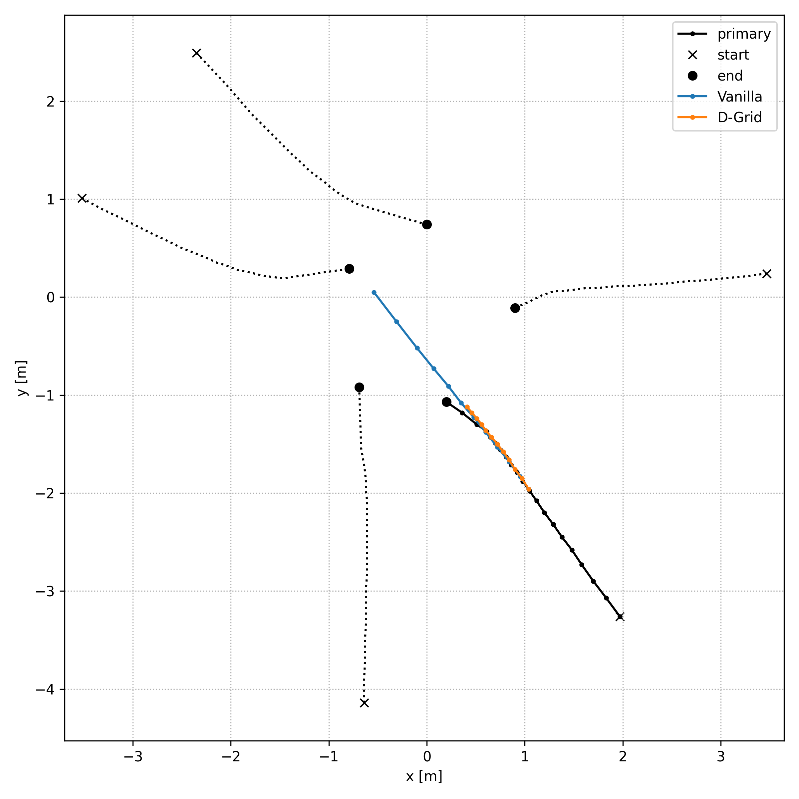
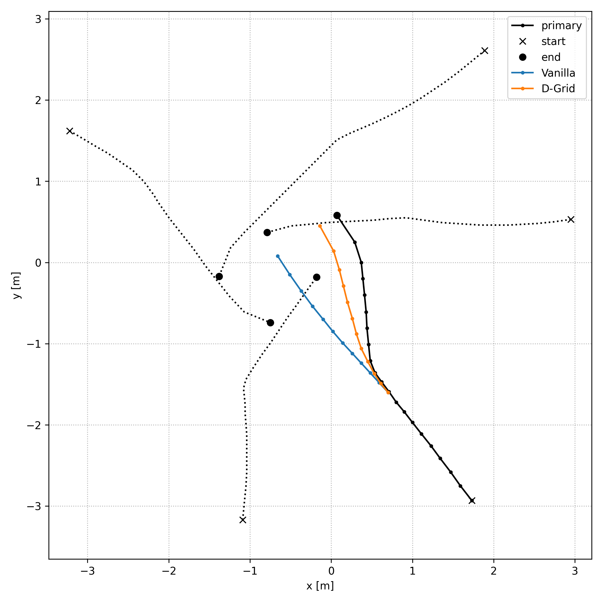
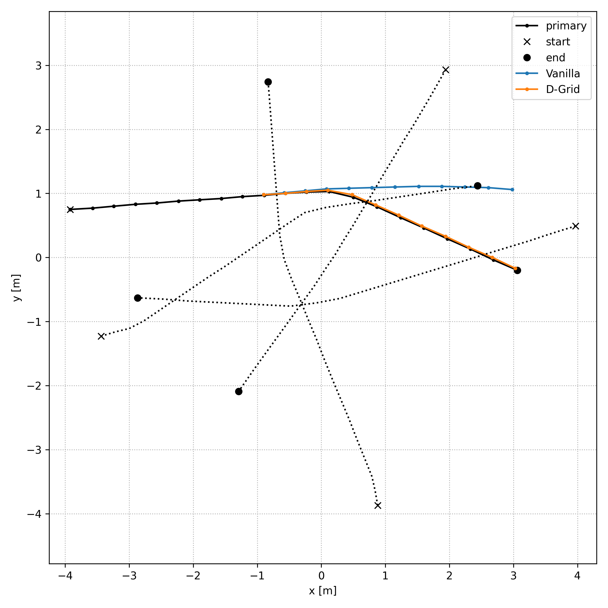
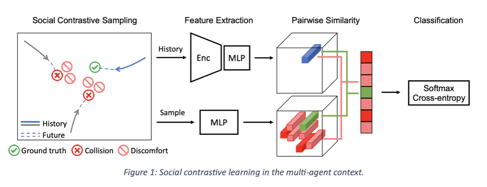

superiority of D-Grid compare to vanilla
========================================

On this graph we can clearly see that the path realised with the vanilla simulation will converge with the other four present trajectories, there is a conflict point at [0,0]. The Vanilla simulation does not know how to react and will tend to accelerate in an attempt to anticipate the trajectories coming from the northwest quadrant of the graph. This will make the situation worse as there is a higher speed and it can only react less well to the change of trajectory such as the one made by the trajectory starting at the point [-4,1]. In contrast to this, the D-Grid simulation opted for a more wait-and-see solution and slightly decreased the speed that was initially planned for the person being steered, thus allowing observation of the behaviour of other people on the graph. Thus we can take a step back and avoid the conflict situation. This behaviour is therefore more appropriate to a situation of convergence of trajectories.

This situation is reminiscent of the convergence situation discussed earlier in this case we observe that the Vanilla simulation converges again with the other trajectories. Contrary to this, the D-Grid simulation will deviate from the point of convergence by anticipating the trajectory coming from the point [3,0.5] as rectilinear and will therefore pass behind this user. Thanks to this anticipation we avoid the conflict zone present in the centre of the graph at the end of the experiment.

This last image is the most representative It first demonstrates that the Vanillas strategy leads to a conflict zone because if we follow the trajectory it dictates we will collide with the trajectory from the point [-3.5,-1] which should never happen. The D-Grid strategy has the ability to follow the trajectory initially planned by the guided person. In our case it is also an optimal trajectory, as it avoids the accident generated by the vanilla strategy by taking the lead.

In a second step (milestone 2), a social contrastive learning to the D-LSTM model has been applied. To do so we have implemented contrastive learning and sampling methods in your own codebase and tuned the social hyperparameters to optimize our results.

Our Social-NCE encourages the extracted motion representation to preserve sufficient training to distinguish a positive future event from a set of synthetic negative events.
At first, we had to find a way not to take into account the data including NaNs. For that we decided to place the trajectories containing NaNs, at the origin of our reference frame, i.e. far from the center of our scene (bottom left corner of our study area) where the trajectories cross and where collision zones are possible.
The negative sampling strategy constructs negative events based on the regions of other agents in the future, since it is generally forbidden to be in the same location as another agent (collision zone) or uncomfortable for multiple agents to visit the same or adjacent locations simultaneously (See Social Contrastive Sampling in figure 1).

This diagram graphically summarizes the structure used to code social contrastive learning.
After having generated the negative and positive samples as explained above, we then have defined the forecasting model that are designed as encoder-decoder neural networks, where the motion encoder first extracts a compact representation hit with respect to the different agent and the decoder subsequently rolls out its future trajectory. We were there able to construct the encoded query and key vectors for the primary agent at each time t. Thank to the features we have extracted we have computed. One of the last thing to do was to train the parametric models jointly with the objective of mapping the positive pair of query and keys to the similar points, relative to the other negative pairs, in the embedding space. To finish we have computed the total loss of our model, which is the sum of the trajectory forecasting and social contrastive loss that we want to minimize.
Once we implemented social contrastive learning we train on real data and synth data using 30 epochs and a weight of 1 and 4 for contrastive learning. Next we tested our models and uploaded them to AIcrowd. Below is the result for the contrastive weight of 1:

.. figure:: docs/train/7img.png

Below is the contrastive weight result of 4:

.. figure:: docs/train/6img.png

Below is the DGrid result without contrastive learning:

.. figure:: docs/train/5img.png

As we can see the overall value of FDE is better for DGrig model. This can be related either to the fact that we were not able to preload the old model and train with the contrastive learning from the old hyperparameters. However in the case in which we choose a weight of 4 for the social contrastive we notice that the number of collisions is lower than the DGrid value. We see that the social contrastive with a weight of 4 has a positive effect on the number of collisions and therefore it takes into account the points around the neighbors that if it is reached could lead to a collision. To see better results for the contrastive learning we should train the models starting from the hyperparameters obtained with the DGrid model in order to start from an already good model.
